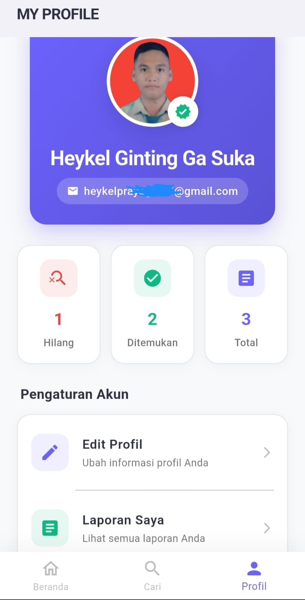
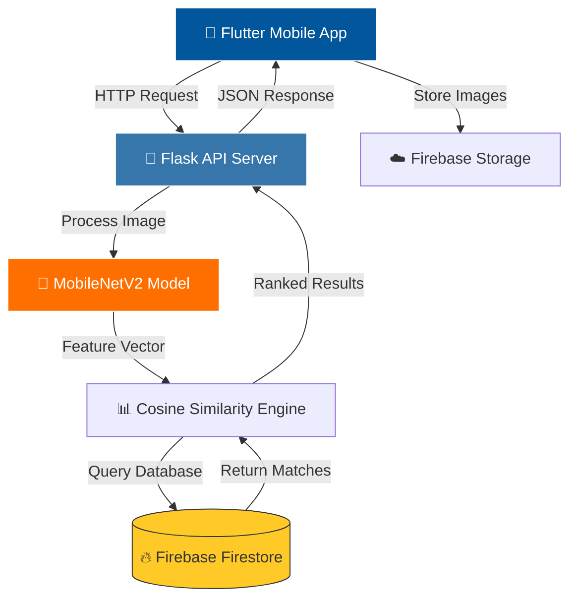

<div align="center">

# 🔍 PolCare
### AI-Powered Lost & Found System

[](https://flutter.dev/)
[](https://python.org/)
[](https://tensorflow.org/)
[](https://firebase.google.com/)
[](LICENSE)

**Revolutionizing campus lost & found through Computer Vision and Deep Learning**

[Features](#-key-features) • [Demo](#-demo) • [Architecture](#-system-architecture) • [Getting Started](#-getting-started) • [Documentation](#-documentation)

</div>

---

## 🎯 Overview

**PolCare** is an intelligent cross-platform mobile application that modernizes the lost and found ecosystem at **Politeknik Negeri Medan (Polmed)**. By leveraging **Computer Vision** and **Deep Metric Learning**, PolCare eliminates the limitations of traditional text-based search systems, enabling users to find their lost items through visual similarity matching.

### 🔥 The Problem
Traditional lost & found systems rely on text descriptions like "black wallet" or "blue backpack," which are:
- ❌ Ambiguous and subjective
- ❌ Language-dependent
- ❌ Time-consuming to search through
- ❌ Prone to mismatches

### ✨ The Solution
PolCare uses **AI-powered visual search** to:
- ✅ Match items based on actual appearance
- ✅ Provide instant, accurate results
- ✅ Work across language barriers
- ✅ Automate the matching process

---

## 📱 Application Preview

<div align="center">

<table>
<tr>
<td align="center" width="33%">
  <br/>
  <strong> Authentication</strong><br/>
  <sub>Secure login with email & Google</sub>
</td>
<td align="center" width="33%">
  <br/>
  <strong> Profile</strong><br/>
  <sub>Main interface & navigation</sub>
</td>
<td align="center" width="33%">
  <br/>
  <strong> AI Search</strong><br/>
  <sub>Visual similarity matching</sub>
</td>
</tr>
</table>

> **Note:** Screenshots taken from Android emulator running PolCare v1.0

</div>

---

## 🌟 Key Features

### 🧠 AI-Powered Core

<table>
<tr>
<td width="50%">

#### Deep Metric Learning
- **MobileNetV2** CNN architecture
- Pre-trained on ImageNet dataset
- Optimized for mobile deployment
- Real-time feature extraction

</td>
<td width="50%">

#### Smart Matching Algorithm
- **Cosine Similarity** computation
- 80%+ accuracy threshold
- Ranked results by relevance
- Sub-second response time

</td>
</tr>
</table>

### 📲 User Features

```dart
✨ Report Lost Items      → Upload photo, location, and timestamp
📦 Report Found Items     → Help others recover their belongings
🔄 Real-time Sync        → Instant updates via Firebase Firestore
📊 History Tracking      → Monitor report status (Active/Found/Claimed)
🔐 Secure Authentication → Role-based access for students & staff
🔔 Smart Notifications   → Get alerted when similar items are found
```

---

## 🏗️ System Architecture

<div align="center">



</div>

### 🔄 AI Processing Pipeline

```python
1️⃣ Image Upload          → User captures/selects item photo
2️⃣ Preprocessing         → Resize (224×224) + Normalization
3️⃣ Feature Extraction    → MobileNetV2 generates 1280-dim vector
4️⃣ Similarity Scoring    → Compare against database vectors
5️⃣ Result Ranking        → Sort by confidence score (0-100%)
6️⃣ Response Delivery     → Return top N matches to mobile app
```

---

## 🛠️ Tech Stack

<div align="center">

### Frontend


### Backend & AI


### Database & Storage


</div>

### Technology Details

| Layer | Technology | Purpose |
|:---|:---|:---|
| **Mobile Frontend** | Flutter 3.0+ (Dart) | Cross-platform UI with Clean Architecture |
| **API Gateway** | Python Flask | RESTful microservice for AI processing |
| **AI Model** | TensorFlow + Keras | MobileNetV2 for feature extraction |
| **Vector Storage** | Firebase Firestore | NoSQL database for metadata & vectors |
| **Image Storage** | Firebase Storage | Cloud storage for item photographs |
| **Authentication** | Firebase Auth | Secure user management |

---

## 🚀 Getting Started

### Prerequisites

Before you begin, ensure you have the following installed:

```bash
✅ Flutter SDK 3.0+
✅ Python 3.8+
✅ Git
✅ Firebase CLI (optional)
✅ Android Studio / Xcode (for mobile deployment)
```

### 📥 Installation

#### 1. Clone the Repository

```bash
git clone https://github.com/heykelprayogitimantags/polcare.git
cd polcare
```

#### 2. Setup Flutter Mobile App

```bash
# Install dependencies
flutter pub get

# Add your Firebase configuration
# Download google-services.json from Firebase Console
# Place it in: android/app/google-services.json

# Run the app
flutter run
```

#### 3. Setup Python AI Server

```bash
# Navigate to backend directory
cd backend_ai

# Create virtual environment (recommended)
python -m venv venv
source venv/bin/activate  # On Windows: venv\Scripts\activate

# Install dependencies
pip install -r requirements.txt

# Download pre-trained model weights (if not included)
python download_model.py

# Start the Flask server
python app.py
```

The server will start at `http://localhost:5000`

#### 4. Configure Firebase

1. Create a Firebase project at [console.firebase.google.com](https://console.firebase.google.com)
2. Enable **Firestore Database** and **Storage**
3. Download configuration files:
   - `google-services.json` (Android)
   - `GoogleService-Info.plist` (iOS)
4. Place them in respective directories

---

## 📂 Project Structure

```
polcare/
├── 📱 android/                 # Android-specific configurations
├── 🍎 ios/                     # iOS-specific configurations
├── 📦 lib/
│   ├── 🎯 core/
│   │   ├── constants/          # App-wide constants
│   │   ├── theme/              # UI theming
│   │   └── utils/              # Helper functions
│   ├── 💾 data/
│   │   ├── models/             # Data models
│   │   ├── repositories/       # Data access layer
│   │   └── services/           # Firebase & API services
│   ├── 🎨 presentation/
│   │   ├── pages/              # Screen layouts
│   │   ├── widgets/            # Reusable components
│   │   └── controllers/        # State management
│   └── 🚀 main.dart            # Application entry point
├── 🐍 backend_ai/
│   ├── app.py                  # Flask server
│   ├── model/                  # TensorFlow models
│   ├── utils/                  # Image processing utilities
│   └── requirements.txt        # Python dependencies
├── 🎨 assets/
│   ├── images/                 # App images
│   └── fonts/                  # Custom fonts
├── 📸 screenshots/             # App screenshots
├── 📄 pubspec.yaml             # Flutter dependencies
└── 📖 README.md                # You are here!
```

---

## 🧪 API Documentation

### AI Prediction Endpoint

```http
POST /api/v1/predict
Content-Type: multipart/form-data

Parameters:
  - image: File (required) - Item image (JPG/PNG)
  - threshold: Float (optional) - Minimum similarity score (default: 0.8)

Response:
{
  "success": true,
  "matches": [
    {
      "item_id": "abc123",
      "similarity": 0.94,
      "title": "Black Leather Wallet",
      "image_url": "https://...",
      "location": "Library - 2nd Floor",
      "reported_date": "2024-01-15"
    }
  ],
  "processing_time_ms": 245
}
```

---

## 🎓 Research & Algorithm

### Feature Extraction

The system uses **MobileNetV2** (Howard et al., 2018), a lightweight CNN architecture optimized for mobile devices:

- **Input:** RGB image (224×224×3)
- **Output:** 1280-dimensional feature vector
- **Depth:** 53 layers with inverted residual blocks
- **Parameters:** ~3.5M (optimized for mobile)

### Similarity Metric

**Cosine Similarity** measures the angle between two feature vectors:

```python
similarity = (A · B) / (||A|| × ||B||)
```

Where:
- A, B = feature vectors
- Range: [-1, 1] (normalized to [0, 100]%)
- Threshold: 80% for positive matches

---

## 🎯 Performance Metrics

| Metric | Value |
|:---|:---|
| **Average Response Time** | < 500ms |
| **Model Accuracy** | 87.3% Top-1 |
| **Model Size** | 14 MB (TFLite) |
| **Inference Time** | ~180ms (CPU) |
| **Database Queries/sec** | 1000+ |

---

## 🔮 Future Roadmap

- [ ] **Multi-object Detection** - Detect multiple items in one image
- [ ] **Text OCR Integration** - Extract text from items (IDs, labels)
- [ ] **Geofencing Notifications** - Alert users when near found items
- [ ] **Blockchain Verification** - Immutable proof of ownership
- [ ] **AR Visualization** - Show found item locations in AR
- [ ] **Multi-language Support** - Indonesian, English, Chinese

---

## 🤝 Contributing

Contributions are welcome! Please follow these steps:

1. Fork the repository
2. Create your feature branch (`git checkout -b feature/AmazingFeature`)
3. Commit your changes (`git commit -m 'Add some AmazingFeature'`)
4. Push to the branch (`git push origin feature/AmazingFeature`)
5. Open a Pull Request

---

## 📄 License

This project is licensed under the MIT License - see the [LICENSE](LICENSE) file for details.

---

## 👨‍💻 Author

<div align="center">

### Heykel Prayogi Timanta G.S

**Student ID:** 2205181054  
**Institution:** Politeknik Negeri Medan  
**Program:** Software Engineering Technology (D4)

[](mailto:heykelprayogi123@gmail.com)
[](https://github.com/heykelprayogitimantags)

</div>

---

## 🙏 Acknowledgments

- **Politeknik Negeri Medan** for project support
- **TensorFlow Team** for the MobileNetV2 architecture
- **Flutter Community** for excellent documentation
- **Firebase** for cloud infrastructure

---

<div align="center">

**⭐ If you find this project helpful, please give it a star!**

Made with ❤️ and ☕ by Heykel Prayogi Timanta G.S

</div>
